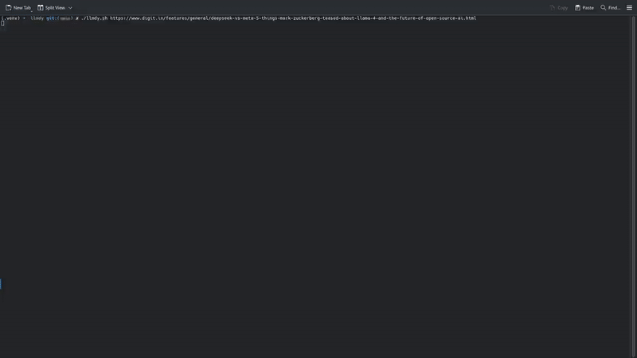

<h1 align="center">
llmdy 📄🔍
</h1>

<p align="center">
<strong>llmdy</strong> is a tool for generating markdown that leverages the NLP capabilities of LLMs. Easily create documents for RAG (Retrieval Augmented Generation) systems from any document or website.
</p>

<div align="center">
  
</div>

## Features 🚀

- **💻 Command-line Interface**: llmdy can be used from the command line to generate markdown. Simply provide it the URL of the document or website you want to convert.

- **🚀 Fast and Efficient**: Heavy data processing is done natively via Rust, and you can run local models via OpenAI API or Ollama (coming soon) without needing to use expensive API providers.

- **🔥 Sophisticated Pipeline**: Under the hood, llmdy uses configurable strategies to handle caching, recovery, and more. Partially generated markdown can always be continued from where it left off, preventing the need to restart the process all over again.

## How to Install ⚡

### From source 💻

#### Prerequisites 📦

- **Rust**: llmdy is written in Rust, so you need to have Rust installed on your system. You can install Rust by following the instructions on the [official Rust website](https://www.rust-lang.org/tools/install).

- **Python**: Python is the core of llmdy. Make sure you have Python installed on your system. You can download it from the [official Python website](https://www.python.org/downloads/).

- **ReaderLM v2**: Trained by [Jina AI](https://jina.ai/), **ReaderLM v2** is what powers llmdy since it is a finetune model specifically designed for HTML-to-Markdown conversion. [The model card can be found here](https://huggingface.co/jinaai/ReaderLM-v2). You will need to configure an OpenAI-compatible endpoint to access this model. This section will cover it.

1. **Clone the repository:** Open your terminal, and run the following command to clone the repository:

```sh
git clone https://github.com/jwmarb/llmdy.git
```

2. **Install the dependencnies**: Navigate to the cloned repository via `cd llmdy`, and run the following command to setup your environment:

```sh
chmod a+x ./setup.sh && ./setup.sh
```

This will install all the necessary packages and compiled code from the Rust code.

3. **Setting up ReaderLM v2 API Endpoint**: llmdy is centered around ReaderLM v2. To easily setup an OpenAI API endpoint, the best way is via [llama-cpp-server](https://github.com/ggml-org/llama.cpp/blob/master/examples/server/README.md). You'll need to install it locally on your machine (tutorial [here](https://github.com/ggml-org/llama.cpp/blob/master/docs/build.md)). Once installed, you'll need to download the ReaderLM v2 model. I highly recommend using quants [here](https://huggingface.co/mradermacher/ReaderLM-v2-i1-GGUF). **Q4_K_M** quants are fine, but you can use a higher quant if you have the resources (e.g. **Q6_K** or **Q8_0**). The command used to start the server is:

```sh
READERLM_V2="path/to/gguf"

llama-server \
  --host 0.0.0.0 \
  --port 8080 \
  --model $READERLM_V2 \
  --alias readerlm-v2 \
  --flash-attn \
  --cache-type-k q8_0 \
  --cache-type-v q8_0 \
  --ctx-size 262144 \
  --gpu-layers 99 \
  --temp 0.0 \
  --batch-size 262144 \
  --top-k 1 \
  --repeat-penalty 1.13 \
  --presence-penality 0.25 \
  --frequency-penalty 0.25
```

This will start serving the model at `http://localhost:8080` or `http://0.0.0.0:8080`. In your `.env` file, `OPENAI_BASE_URL` should be set to `http://localhost:8080/v1`

4. **Configure the `.env` file**: Run the following:

```sh
cp .env.example .env
```

From there, you will need to edit the configuration and set them appropriately. If you are following from the previous step, `OPENAI_BASE_URL` should be set to `http://localhost:8080/v1`, otherwise set it to an appropriate endpoint that contains your ReaderLM v2 model. The name should also match the model. The following configuration will work if you are following from the previous step:

```plaintext
OPENAI_API_KEY=doesntmatter
OPENAI_BASE_URL=http://localhost:8080/v1
READERLM_MODEL=readerlm-v2
CACHE_STRATEGY=memory
CACHE_TTL=3600
RECOVERY_STRATEGY=disk
```

5. **Run llmdy**: With everything setup, (hopefully) you can run llmdy. Run the following:

```sh
chmod a+x ./llmdy.sh && ./llmdy.sh
```

If it works, you should see `llmdy: error: the following arguments are required: url`.

For a quick demo, you can run the following:

```sh
./llmdy.sh --out OUTPUT.md --output-html true https://cs.lmu.edu/~ray/notes/plstudy/
```

## License 📜

This project is licensed under the MIT License - see the [LICENSE](LICENSE) file for details.

## Contributing 🙌

todo

---

Created with ❤️ by Joseph Marbella
